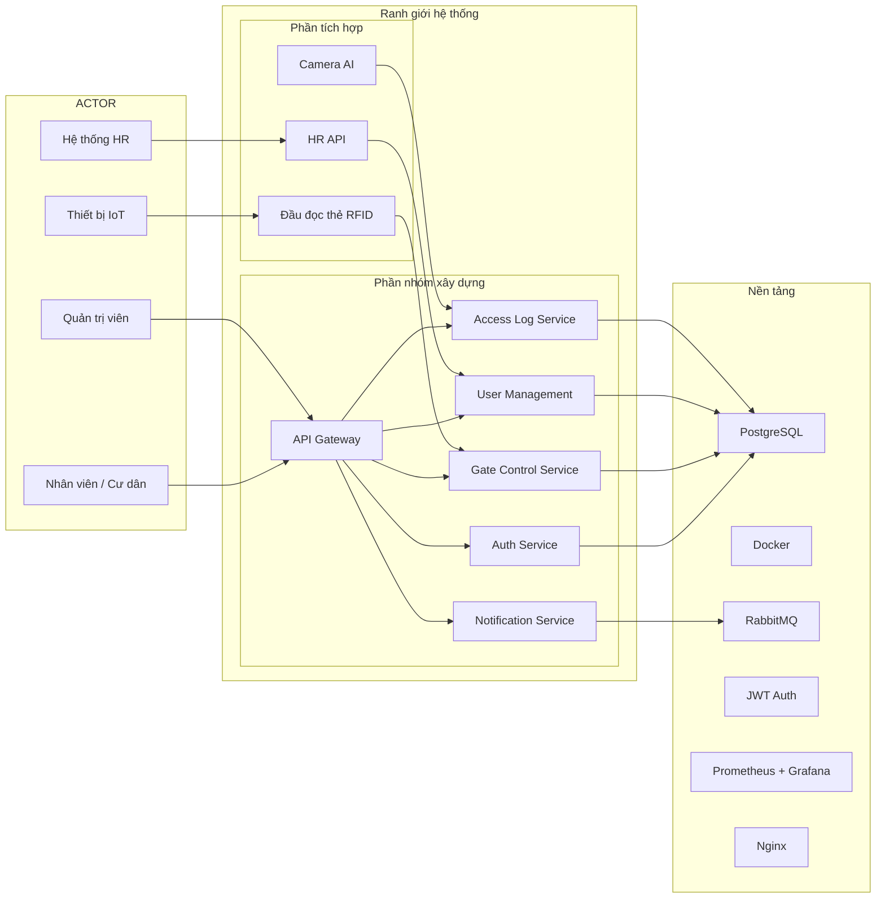

# Service Boundary của nhóm

## 1. Thông tin nhóm

- Tên nhóm: Access Gate
- Lớp: FIT4110
- Thành viên: (điền tên thành viên)
- Service nhóm phụ trách: Access Gate — Dịch vụ kiểm soát ra/vào
- Sản phẩm tổng thể của lớp: Hệ thống quản lý tòa nhà thông minh

## 2. Actor

Ai tương tác với hệ thống/service?

- **Nhân viên / Cư dân**: Người ra/vào cổng, quẹt thẻ hoặc nhận diện khuôn mặt
- **Quản trị viên**: Quản lý người dùng, cấu hình quyền truy cập, xem log ra/vào
- **Thiết bị IoT**: Đầu đọc thẻ RFID, camera giám sát, sensor cổng
- **Hệ thống HR bên ngoài**: Đồng bộ danh sách nhân viên/cư dân

## 3. System Boundary

Nhóm em xây phần nào?

Phần nhóm kiểm soát:

- API Gateway (điểm vào duy nhất, routing, rate limiting)
- Auth Service (xác thực JWT, phân quyền)
- Gate Control Service (điều khiển mở/đóng cổng, xử lý logic ra/vào)
- User Management (CRUD người dùng, quản lý thẻ, quyền truy cập)
- Access Log Service (ghi nhận lịch sử ra/vào, báo cáo thống kê)
- Notification Service (gửi thông báo khi có sự kiện bất thường)

Phần nhóm chỉ tích hợp:

- Camera AI (nhận diện khuôn mặt, phát hiện bất thường)
- Thiết bị đọc thẻ RFID (phần cứng bên ngoài)
- HR API bên ngoài (đồng bộ dữ liệu nhân sự)

## 4. Service Boundary

Service của nhóm có trách nhiệm gì?

- Xác thực và phân quyền người dùng ra/vào
- Điều khiển cổng (mở/đóng) dựa trên quyền truy cập
- Ghi nhận log mọi lượt ra/vào
- Quản lý danh sách người dùng và thẻ truy cập
- Gửi cảnh báo khi phát hiện truy cập bất thường

Service KHÔNG làm gì?

- Không xử lý nhận diện khuôn mặt (tích hợp Camera AI bên ngoài)
- Không quản lý phần cứng đầu đọc thẻ (chỉ nhận dữ liệu từ thiết bị)
- Không quản lý thông tin HR chi tiết (chỉ đồng bộ danh sách)

## 5. Input / Output

### Input

- Dữ liệu quẹt thẻ RFID (mã thẻ, thời gian, vị trí cổng)
- Yêu cầu xác thực từ thiết bị IoT
- Thông tin người dùng từ hệ thống HR
- Lệnh quản trị từ admin (tạo/sửa/xóa người dùng, cấu hình quyền)

### Output

- Lệnh mở/đóng cổng
- Log ra/vào (thời gian, người, cổng, trạng thái)
- Thông báo cảnh báo (truy cập trái phép, thẻ hết hạn)
- Báo cáo thống kê ra/vào

## 6. API dự kiến

| Method | Endpoint | Mục đích |
|---|---|---|
| GET | /health | Kiểm tra service |
| POST | /api/auth/login | Đăng nhập, lấy JWT token |
| POST | /api/gate/access | Xử lý yêu cầu ra/vào |
| GET | /api/logs | Lấy danh sách log ra/vào |
| GET | /api/users | Lấy danh sách người dùng |
| POST | /api/users | Tạo người dùng mới |
| PUT | /api/users/:id | Cập nhật thông tin người dùng |
| DELETE | /api/users/:id | Xóa người dùng |
| POST | /api/notifications/alert | Gửi cảnh báo |

## 7. Phụ thuộc service khác

Service này gọi đến service nào?

- HR API (đồng bộ danh sách nhân viên)
- Camera AI Service (xác thực khuôn mặt)

Service nào gọi đến service này?

- Dashboard/Monitoring Service (lấy dữ liệu log)
- Admin Panel (quản lý người dùng, xem thống kê)

## 8. Sơ đồ minh họa

